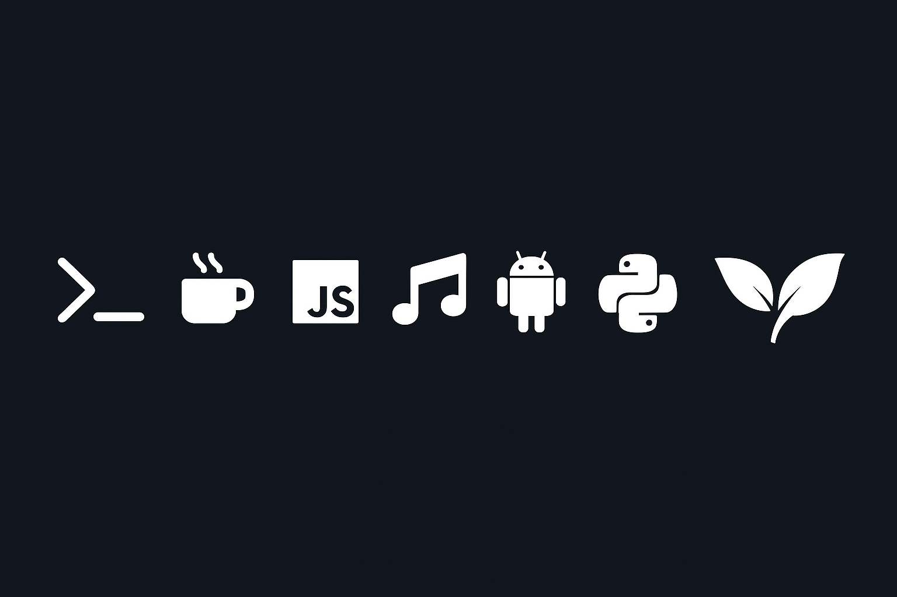

  

## 👾 About Me 
👋 Hi, I’m **Chandu**, the mind behind **Techvide** ⚡  
🐧 Passionate about **Linux**, **Termux**, and **automation** — I build scripts and tools that actually *do the job*.  
🤖 Focused on **AI-assisted development**, **automation workflows**, and **practical problem-solving**.  
🧠 Always experimenting, breaking things, and rebuilding them smarter.  
🌱 Constantly learning new tech, exploring creative automation ideas, and simplifying complex setups.  
💬 Based in India — open to collaborating on Linux automation, AI tools, and open-source projects.  

---

## 💻 Tech Stack  

| Category | Tools & Languages |
|-----------|------------------|
| **Languages** |    |
| **Operating Systems** |    |
| **AI / Automation** |   |
| **Version Control / Deployment** |   |
| **Databases** |  |
| **Tools / Others** |   |

---

## 📊 GitHub Stats  

  

---

## 🌐 Connect With Me  

---

⭐ *“Automate smart. Build real. Fix fast.”*  
